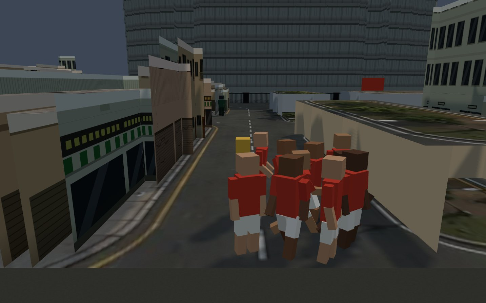
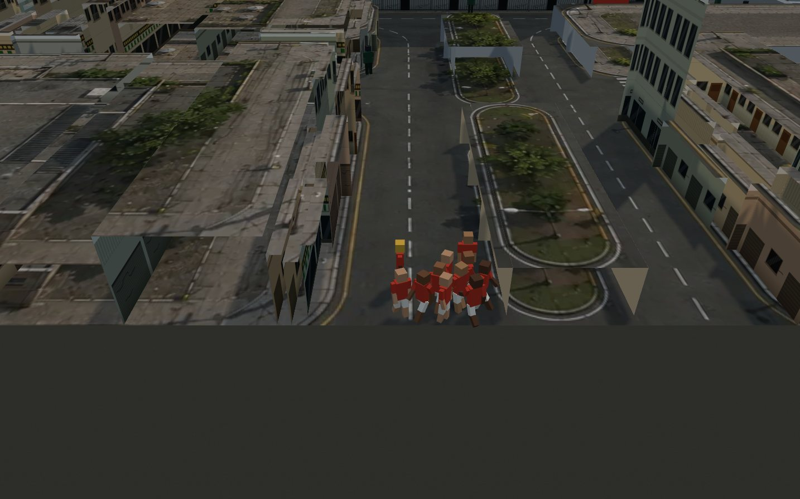
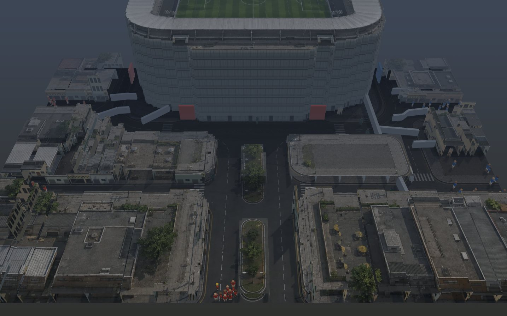
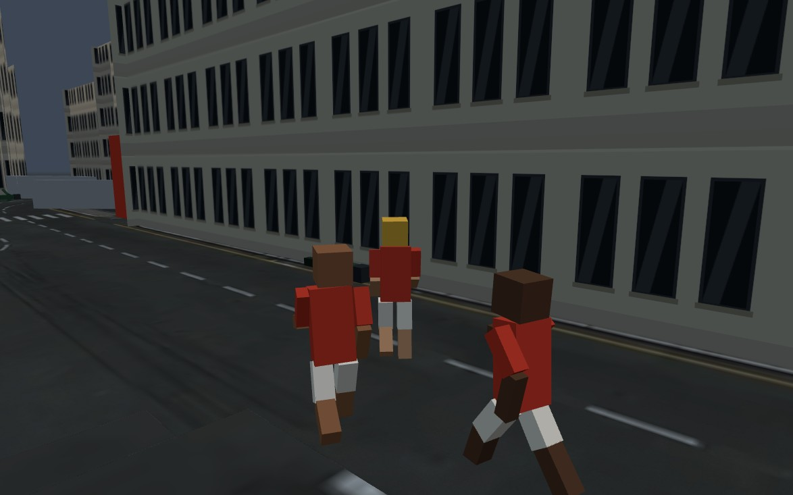
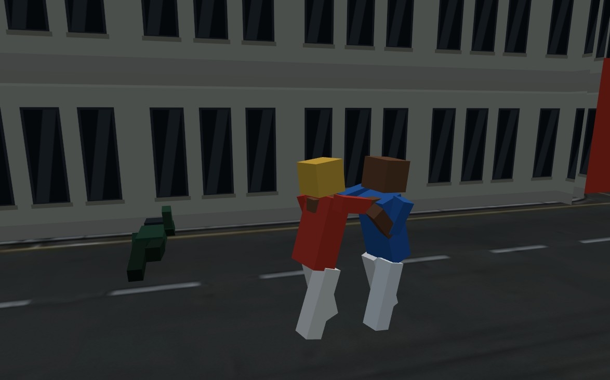
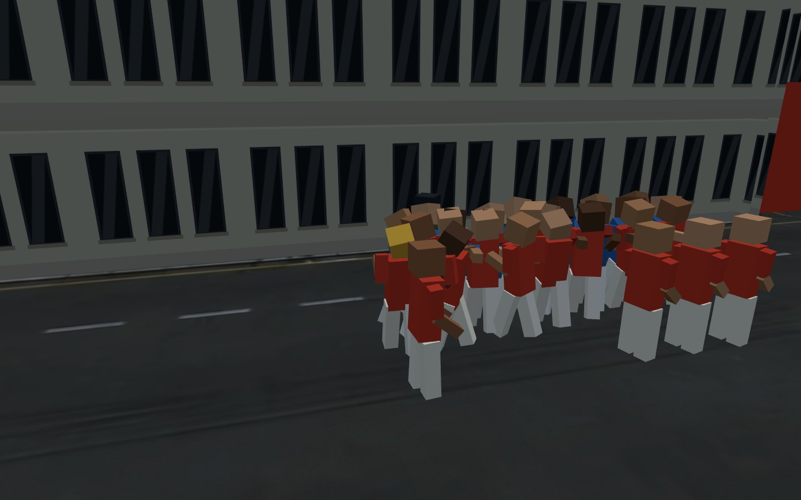
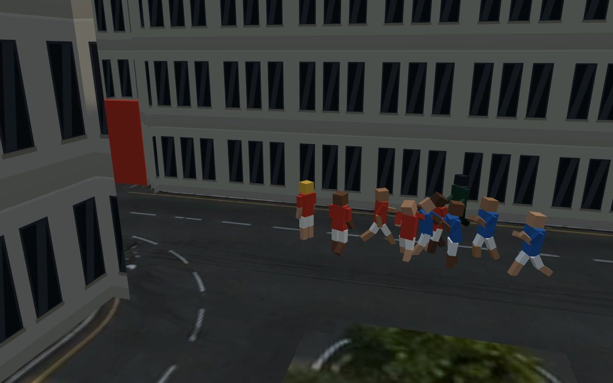
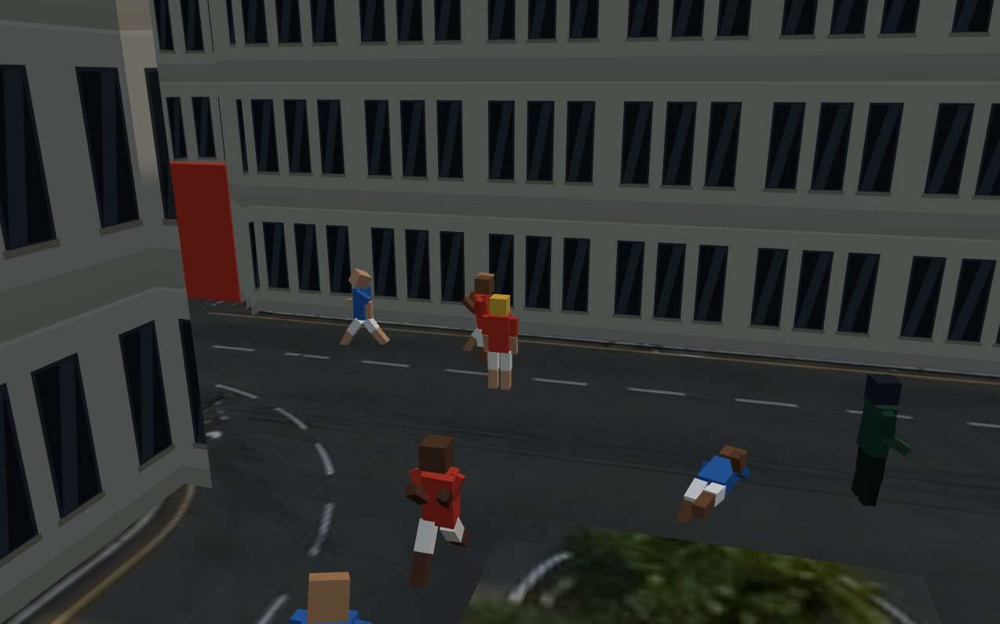
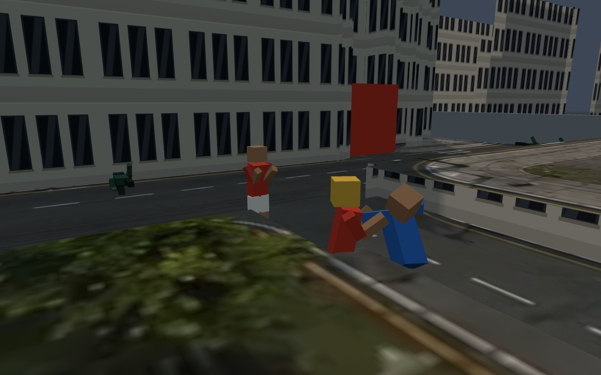
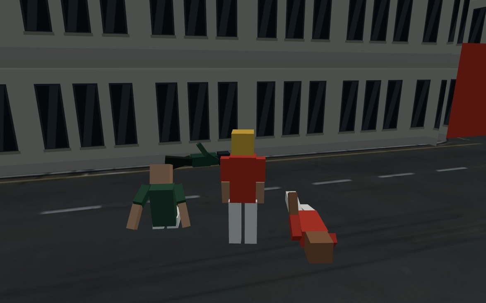

# CENA 3D — o que já roda, o que custa, e o que decidir antes

Documento de trabalho. O pedido era planejar um cenário 3D dos arredores do
estádio, em HTML, com câmera de perto estilo GTA e um personagem humano andando
pelos controles do jogo. Em vez de planejar no papel, subi a coisa rodando: dá
pra abrir, andar e julgar. O que está aqui é o que a maquete provou, o que ela
não resolve, e a conta de cada caminho daqui pra frente.

---

## 1. O que existe agora

| arquivo | o que é | linhas |
|---|---|---:|
| `arredores3d.html` | a bancada 3D: as 9 abas da bancada 2D, agora em 3D | ~230 |
| `js/diajogo/cena3d.js` | o desenhista 3D inteiro | ~700 |
| `vendor/three/` | three.js r160, versão de módulo, embutida no repositório | 655 KB |

**Abrir:** o navegador não carrega módulo ES por `file://`. Precisa de servidor:

```
python3 -m http.server 8000
# depois: http://localhost:8000/arredores3d.html
```

**Controles:** WASD anda (relativo à câmera), 1–4 formação, Q pedra, E bomba,
R recuar, arrastar gira a câmera, roda aproxima. A briga acontece sozinha
quando os dois bondes se encostam — o soco, o tranco e a queda são pose, não
botão. `Z` ombro, `X` alta,
`C` maquete, `F` zenital, `B` troca a altura dos prédios, `H` liga e desliga a sombra,
**`V` alterna 2D ↔ 3D na mesma partida** — é a tecla que interessa, porque
mostra os dois desenhistas lendo o mesmo estado, sem recomeçar nada.







---

## 2. A decisão de arquitetura, e por que ela se sustentou

**`combate.js` não foi tocado.** Nenhuma linha. O 3D é um segundo desenhista
que lê o `J` uma vez por quadro e põe em pé; a simulação continua sendo o
mesmo tabuleiro 2D de 1536 × 1024, com a mesma malha de 8 px, a mesma colisão,
os mesmos campos de fluxo, a mesma polícia. É por isso que o `V` funciona.

Três coisas fizeram isso sair barato:

**O chão sai de graça.** `arredores.desenharFundo(ctx)` já sabe pintar qualquer
uma das oito cenas — a foto aérea dos arredores ou a pintura procedural da
praça, da rua, do bar, do comércio, do CT. Chamamos ela num canvas fora da tela
e o resultado vira a textura do plano. **Zero arte nova, e as oito cenas
entraram juntas.**

**Os prédios saem da malha, não de modelagem.** A lista `poligonos.bloqueio`
dos arredores tem 9 retângulos; a foto tem trinta e poucos prédios. Extrudar a
lista deixaria parede invisível espalhada pela cena — você bate e não vê no
quê. Então quem sobe é `A.malha`, a mesma que a colisão usa: componentes
ligados das células bloqueadas → retângulos por *greedy meshing* → uma altura
e uma cor por componente. Nos arredores dá **15 prédios em 111 caixas**, e a
garantia é forte: *não existe parede que só o desenho tem, nem passagem que só
o desenho fecha.*

**O telhado é a própria foto.** O topo de cada caixa recebe a textura do chão
projetada de cima, recortada na região que a caixa ocupa. O telhado da caixa é
o telhado que está na foto, alinhado ao pixel — foi isso que dispensou material
de telhado.

### A fachada, com o vocabulário da cena 2D

A primeira versão tinha um azulejo só — laje, três janelas, peitoril — repetido
do chão ao topo em toda parede. A cidade inteira virava prédio de escritório.
`cenario.js` já tinha o vocabulário certo e a paleta do bairro, então as duas
coisas passaram a sair de lá (exportadas: `TELHADO`, `LAJE`, `PAREDE`,
`PICHACAO`, `hash`, `dado`, `frac`), pra não existirem duas periferias
diferentes no mesmo jogo.

**Sete tipos, e cada um com duas texturas.** casa, sobrado, comércio, galpão,
prédio, muro e estádio. A segunda textura é o que mais conta: **o térreo não se
repete.** Rua é portão de garagem, vitrine com toldo listrado, porta de rolo,
janela gradeada e pichação na altura do braço; do primeiro andar pra cima é
janela e parede. Empilhar o mesmo azulejo do chão ao topo era exatamente o que
deixava genérico. Cada parede sai em três faixas — térreo (não repete), andar
(repete) e platibanda.

**O bairro é de casa, não de prédio.** A régua anterior tinha um "prédio comum"
de 168 unidades e mandava todo quarteirão grande pra lá. Agora a altura sai do
tipo — casa térrea 44, sobrado 78, comércio 52, galpão 58 — e o sorteio dá
**56% casa, 22% comércio, 14% sobrado, 6% galpão e 2% prédio**: o edifício
solitário que todo bairro tem. Só o estádio continua alto (300).

**E o quarteirão virou lote.** A malha entrega o quarteirão inteiro como um
retângulo, e um retângulo só vira um galpão de duzentos metros. Cortado em
lotes de ~78 unidades (uns 8 m na régua da foto), cada pedaço ganha altura, cor
e tipo próprios — e o quarteirão vira fileira de casa com um comércio no meio.
A cor sai de `PAREDE` com uma pitada (14%) da cor do telhado na foto, pra a casa
não descolar do que está desenhado em cima dela.

---

## 3. O boneco

Dez peças de caixa — cabeça, tronco, dois braços com **cotovelo** e duas pernas
com **joelho** — e **uma malha instanciada por peça**: 400 pessoas custam 10
chamadas de desenho, não 400. Tudo procedural: o desenhista guarda a posição do
quadro anterior e tira dali a direção, a velocidade e a fase da passada.

**Cotovelo e joelho não são capricho.** Com um osso por braço, guarda e soco são
o mesmo gesto com dois ângulos parecidos e ninguém distingue um do outro a três
metros; com dois, guarda é o antebraço em pé na frente do rosto e soco é o
antebraço abrindo. Com um osso por perna, andar é pêndulo: o pé varre o chão na
volta e o corpo não tem peso. Cada junta custou duas malhas instanciadas.

**Nenhum arquivo de modelo, nenhum osso importado, nenhuma animação de fora.**
É de propósito: o boneco de caixa é o *lugar* onde o boneco do Blender entra
depois, com a mesma interface — `porPessoa(alvo, i, estado, sinais, cores)`.

A manga é a cor primária da torcida e o antebraço é pele; o calção é a cor
secundária. São as mesmas duas cores que o disco 2D usa (§8.12). O líder usa
boné dourado.

### A passada, com peso

Quatro coisas, e cada uma responde por um pedaço:

**A abertura do quadril é constante, e isso não é preguiça.** A fase anda com a
*distância* — 0,19 rad por pixel — então o ciclo fecha a cada 33 px e cada passo
cobre 16,5 px de chão. Pra o pé não patinar, a perna tem que abrir exatamente o
tanto que dá esses 16,5: `asin(16,5 / 26) ≈ 0,66`, e esse número não depende da
velocidade. Quem anda devagar dá o mesmo passo mais espaçado; a cadência já muda
sozinha. O que a velocidade controla é joelho, braço e inclinação.

**O joelho só dobra na perna solta.** Dobra máxima no meio do balanço, quando a
perna passa por baixo do corpo, e zero no apoio: é `max(0, −cos fase)`. A perna
de apoio fica reta e aguenta o corpo, a solta encolhe pra passar sem varrer o
chão.

**O quadril desce quando as pernas abrem.** Não é enfeite, é trigonometria: com
as pernas abertas em θ o pé fica `L·(1−cos θ)` mais longe do quadril, então o
corpo baixa outro tanto — 2,7 px no passo cheio, duas vezes por ciclo. É esta
descida que dá peso, e ela fecha a conta: no ponto mais baixo o pé encosta no
chão exatamente. A versão anterior fazia o contrário, subia o *tronco* com
`|cos|` e deixava os pés parados — corpo flutuando sobre perna rígida.

**O tronco ginga e inclina.** Meio pixel de bamboleio lateral por passo, e o
tronco cai pra frente com a velocidade enquanto a cabeça compensa pra o olhar
ficar no horizonte.

Uma correção de escala junto: `e.vel` divide por **88** e não por 60, que é a
velocidade de todo mundo na cena. Com 60 no divisor qualquer deslocamento normal
batia no teto e o boneco vivia em pose de corrida; em 88, andar no passo do
bonde dá 0,68 e sobra topo pra quem persegue e pra quem foge.



---

## 3.1 Bater e apanhar — tirado do que a simulação já guarda

`combate.js` não tem pose, não tem direção e não tem "estou dando um soco
agora". Tem outra coisa, e ela basta:

| campo | o que é | vira |
|---|---|---|
| `d.golpe` | 0,12 e caindo — acertei alguém neste quadro | soco, alternando o braço |
| `d.tremor` | até 6, caindo a 9/s — levei pancada agora | tranco: cabeça pra trás, braços abrindo |
| `d.hostil` | até 4 s depois do último contato | guarda alta |
| `d.atordoado` | cassetete da PM, 0,7 s | perna bamba |
| `d.preso` | — | sentado no chão, mãos pra trás |
| `p.cooldown` | salta pra 1,9 no quadro em que o PM acerta | cacetada |

E a fuga, que a simulação separa em três estados e o desenho tratava como
"andar mais rápido":

| campo | o que é | vira |
|---|---|---|
| `d.correEm` ≠ null, `!d.fugindo` | quebrou e ainda não virou as costas | mãos altas, tronco pra trás, **encarando** |
| `d.fugindo` | virou as costas, corre a 1,25× | tronco à frente, braço bombeando, **olhada por cima do ombro** |
| `d._cacando` | corre atrás de quem fugiu, no mesmo passo | tronco à frente, **dois braços esticados** |
| `d.agarrado` | mão em cima, 1,2 s até ir ao chão | tronco puxado pra trás, cabeça virada, arrastado |

**Nada foi acrescentado ao combate.** Se o boneco levanta o braço, é porque o
dano saiu de verdade — a pose é leitura do estado, não uma segunda simulação.

**Uma exceção, e ela foi na direção contrária.** O rumo do corpo era invenção
daqui: saía da diferença de posição entre dois quadros e servia só pra pose.
Quando o dano passou a valer só na frente (RESUMO §8.31), o rumo virou estado de
simulação — `d.ang`, atualizado por `apontar()` em `combate.js` — e este arquivo
passou a **ler** em vez de calcular. Um boneco encarando um lado e ferindo outro
é a tela mentindo sobre a regra. O cálculo antigo ficou como reserva, pra quando
`ang` não existir.

**Os 2,6 s que ninguém via.** `soltarFuga` inventou de propósito um atraso entre
"o bonde quebrou" e "este sujeito virou as costas" — quem está de frente pro
inimigo é o último a correr, e é essa ponta atrasada que dá ao perseguidor o
tempo de cobrir os 130 px do alcance de busca. O comentário no código diz que
sem isso *"o jogador que rastreou o rival pela cidade abre a briga pra assistir
ela terminar sozinha"*. O número existia desde sempre e **não aparecia na tela**:
os quatro estados acima eram o mesmo boneco andando. Agora dá pra ver quem já
quebrou antes de ele correr.

Uma coisa que eu **não** fiz, e é a diferença entre desenhar o estado e inventar
um: nesses 2,6 s o boneco não anda de costas. A simulação não manda ele recuar —
ele continua fazendo o que fazia. Inverter a perna aqui dava moonwalk. O que
muda é o corpo.

**Quem está segurando quem.** `contatos` marca quem apanha (`agarrado`) e não
marca quem segura. Mas segurar é bater em quem foge estando em cima: se eu
acerto neste quadro e o inimigo mais perto está com a mão em cima dele, a mão é
a minha. Sai do mesmo balde que já responde "pra quem virar o rosto".

Duas coisas que a simulação não guarda e o desenho precisava:

**Pra quem virar o rosto.** Ninguém soca de lado. Quem está em briga encara o
inimigo mais perto, e isso é uma busca — que a 400 pessoas seria 400 × 400 por
quadro. Resolvido com o mesmo truque de balde que `combate.js` usa na separação:
O(n) pra montar, nove baldes pra consultar, e só montado quando existe alguém
em briga na cena.

**Quem jogou a pedra.** `arremessar` não marca ninguém. Mas o projétil tem
velocidade constante e guarda o tempo de voo, então a origem volta por
`x − vx·t` — e quem está em cima dela é o braço. Daí sai a pose de armar atrás
da cabeça e soltar à frente.

**Um erro que valeu a nota:** a primeira versão lia `tremor` como *nível*. Como
ele satura em 6 e fica lá enquanto o contato durar, o boneco brigava com a
cabeça jogada pra trás o tempo todo, olhando pro céu. O que interessa é a
**subida**: cada pancada nova dá um tranco de 0,3 s e o tranco passa.













---

## 4. Os números, medidos

Medidos no navegador, na cena dos arredores, com 63 pessoas em pé.

| o quê | valor |
|---|---:|
| CPU do desenhista 3D por quadro, noite parada | **0,47 ms** |
| CPU do desenhista 3D por quadro, **todo mundo em briga** | **0,49 ms** |
| CPU da simulação por quadro (`combate.passo`) | **0,61 ms** |
| montar os prédios do zero (BFS + greedy + lotes + geometria) | **35 ms** |
| chamadas de desenho por quadro | **43** |
| triângulos na cena | **~19 000** |
| prédios / lotes nos arredores | 15 / 400 |
| prédios / lotes na praça | 8 / 255 |

**Com a briga inteira animada, o desenhista 3D ainda custa menos do que a
própria simulação.** Isso responde a pergunta de CPU e é o número que mais
importa: pôr em pé não é o gargalo. O caminho inteiro — soco, tranco, guarda,
joelho, peso no passo, os três estados de fuga e o agarrão — cabe em meio
milissegundo por quadro, e o índice espacial que descobre "pra quem virar o
rosto" só é montado quando existe briga ou fuga na cena.

**O que eu não pude medir: a placa de vídeo.** Este ambiente só tem rasterizador
por software (SwiftShader), onde a cena roda a 4–5 quadros por segundo. Com 22
chamadas e 7 mil triângulos, num GPU de verdade isto é trivial — mas isso é
inferência, não medição. **Rode aí e olhe o contador de fps antes de acreditar
em mim.** Se estiver ruim, o primeiro suspeito é a sombra: o mapa de 2048²
redesenha a cena inteira todo quadro e é o item mais caro da lista — **`H`
desliga**, e a diferença entre os dois números diz se é ela.

---

## 5. Onde a escala não fecha — e isto é o achado do dia

A cena não é um lugar, é um tabuleiro. Isso não aparecia de cima; de perto,
aparece na hora.

**A régua.** Medi as listras da faixa de pedestre na foto: banda clara de ~4 px
repetindo a cada ~10 px. Faixa de pedestre é listra de meio metro com vão de
meio metro, então **1 px ≈ 10 cm** (±20%, é foto gerada, não levantamento).
Daí sai tudo:

| coisa | na cena | em metros | o que devia ser |
|---|---:|---:|---|
| a cena inteira | 1536 × 1024 px | **154 × 102 m** | um quarteirão — está certo |
| corpo do disco | raio 7 px | **1,4 m de largura** | 0,5 m → **2,8× largo demais** |
| `P.velocidade` | 60 px/s | **6 m/s** | andar é 1,4; correr é 3 → **4× rápido demais** |
| o boneco que desenhei | 31 px de altura | **3,1 m** | 1,8 m → **1,7× alto demais** |
| pedra (§4, alcance) | 170 px | **17 m** | plausível |
| prédio no modo `rua` | 168 px | **16,8 m** | 5 andares — plausível |

O boneco está a 3,1 m porque eu o dimensionei pelo **disco de colisão**, não
pela foto. Se eu o pusesse em 1,8 m, cada pessoa passaria a andar dentro de uma
bolha de colisão duas vezes maior que ela, e a multidão ficaria com buraco de
1 m entre um sujeito e outro — a briga vira roda de capoeira.

**São dois caminhos, e só dois:**

- **(a) Aceitar o boneco grande.** É o que está no ar. Fica com cara de
  boneco de mesa vivo — legível, coeso, e nada mais precisa mudar. O preço é
  que a cena nunca vai parecer uma rua de verdade: as pessoas são gigantes
  correndo a 6 m/s numa avenida de 15 m.
- **(b) Reescalar a cena inteira, ~2,5×.** Corpo com raio 3, velocidade 22 px/s,
  alcance de pedra e raio da PM proporcionais, célula da malha de 8 pra 4 (o
  que quadruplica a malha), máscara refeita, e **todos os spawns, portões,
  postos de PM, grades e filas de `cena_arredores.js` movidos** — mais as oito
  cenas de `cenas.js`. E depois recalibrar `P` inteiro: dano por quadro,
  separação, debandada, carga da PM. **Isso não é trabalho de render, é
  trabalho de level design e de calibragem, e é o maior item desta lista.**

Não dá pra fugir dessa escolha adiando: tudo que for feito de arte a partir de
agora nasce preso a uma das duas réguas.

---

## 6. O que a câmera de perto custa ao jogo — sem enfeitar

Vou ser direto, porque isto é o que decide se vale.

**A formação some.** O GDD já fechou que "líder é âncora física, não cursor de
comando; **formação é a decisão principal**" (§7). Bonde, Muralha, Investida e
Espalhar são figuras que só existem vistas de cima. Na câmera de ombro você vê
seis nucas e mais nada — a decisão principal do combate fica invisível
exatamente na tela em que ela é tomada.

**O cordão some junto.** Romper 35% do cordão é a conquista da cena (§3.4).
De ombro você não enxerga o cordão inteiro, então não sabe onde ele está fino,
nem que ele quebrou até o aviso aparecer. A leitura vira texto.

**A polícia deixa de ser lida e vira susto.** Hoje a atenção policial é
espacial: você vê a viatura vindo e decide. De perto, ela aparece.

**O que a câmera de perto ganha, e é real:** a rua vira lugar. O bonde tem
tamanho. A pedra tem altura de verdade (no 2D a altura do arremesso é mentira
desenhada; em 3D é altura). O portão do estádio deixa de ser uma barra
vermelha e vira uma coisa em que você corre. Isso não é pouco, mas é *outra*
coisa — é ambiente, não é tática.

**A câmera já não entra em prédio.** Ela caminha do jogador até a posição e
compara a altura de cada célula com a altura do olho ali; achou parede mais
alta, encosta e olha de cima pra baixo. O campo de altura por célula é
preenchido quando os prédios são montados — a malha de caminhabilidade sozinha
não servia, porque ela não sabe se o obstáculo tem 16 ou 300 de alto e canteiro
não tapa nada. A primeira tentativa subia a câmera por cima do prédio; com
prédio de 280 isso virava vista de pássaro no meio da briga, e foi trocado por
encostar.

**A saída honesta é não escolher uma câmera só.** Já está no ar: `Z` ombro para
o deslocamento e a chegada, `X` alta para a briga, `C` maquete para ler o
cordão. Um jogo que troca de câmera pela fase da noite mantém a decisão
legível e ainda entrega a rua. **Minha recomendação é essa** — e se for pra ter
uma câmera só, que seja a `alta` (`X`), que é a que ainda mostra formação.

---

## 7. O que ainda não existe

Em ordem de quanto muda a impressão por hora gasta.

1. **Meio-fio e calçada.** A malha diz "dá pra pisar" e mais nada, então a
   calçada é chão pintado e o prédio nasce direto do asfalto. Um degrau de 15 cm
   em volta de cada quarteirão resolve 80% da sensação de rua.
2. **Poste, semáforo, lixeira, carro parado.** As cenas desenhadas já têm
   `enfeites` e `varais` em `cenas.js`, e o 3D **ignora os dois** hoje.
   Aproveitar essa lista é barato e é o que tira a cara de maquete vazia.
3. **A textura do chão de perto.** A foto tem 1 texel por unidade de mundo e a
   câmera de ombro amplia isso ~14×. Tem um granulado por cima segurando, mas
   asfalto e calçada continuam borrados a dois metros. O certo é uma segunda
   camada de detalhe por tipo de piso, tirada da máscara.
4. **Entrada por vetor.** `moverLider` lê quatro booleanos, então a câmera de
   ombro só consegue mandar oito direções (giro a intenção e devolvo os quatro
   que mais se parecem com ela). Andar na diagonal contra a parede fica
   engasgado. O conserto é `moverLider` aceitar `{dx, dy}` — é uma mudança
   pequena em `combate.js` e a primeira que eu faria lá.
5. **Rosto, roupa, variação.** Todo mundo tem o mesmo corpo. Cinco tons de pele
   e duas cores de camisa é o que separa uma pessoa da outra.

---

## 8. O caminho do Blender, quando ele entrar

Você é iniciante no Blender, então vou dizer o que eu faria e o que eu **não**
faria.

**Não modele nem faça o rig de um humano do zero.** É o trabalho mais difícil
que existe pra quem está começando, e não é onde este jogo ganha.

**O caminho curto:** Mixamo (grátis, da Adobe) — pega um personagem pronto ou
sobe um seu, ele faz o rig automático, e você baixa `andar`, `correr`, `soco`,
`levar soco`, `cair`, `arremessar` como FBX. Importa no Blender, junta as
animações num arquivo, exporta **glTF/GLB**. É o formato que o three.js carrega
sem plugin. Uma tarde, não um mês.

**O gargalo é a multidão, não o modelo.** 400 personagens com esqueleto de
verdade não cabem em `InstancedMesh` — cada um precisa das próprias matrizes de
osso. Os três caminhos, do mais fácil ao mais rápido:

- **LOD por distância** — modelo com osso só para os ~20 mais perto da câmera,
  boneco de caixa para o resto. É o que eu faria primeiro: aproveita tudo que
  já está escrito e o boneco de caixa continua ganhando o pão.
- **Textura de animação (VAT)** — assa cada pose num texture e lê no shader.
  Aí sim dá 400 animados em uma chamada, mas exige shader customizado e um
  script de assar no Blender.
- **`InstancedSkinnedMesh`** — existe em versões recentes do three.js, resolve
  o caso médio, e é o que eu olharia antes de partir pra VAT.

**Onde o Blender ganha muito mais rápido:** no cenário, não na gente. Um kit de
quarteirão — fachada de esquina, fachada de meio, poste, ponto de ônibus,
grade, camburão — em glTF, instanciado sobre os retângulos que a maquete já
extrai da malha, transforma a cena e é modelagem de caixa, que é onde iniciante
consegue trabalhar bem. **Se for pra aprender Blender em cima deste jogo,
aprenda por aí.**

---

## 9. As decisões

**Duas fechadas pelo autor:**

1. **A câmera de perto é UMA DAS CÂMERAS, não o jogo.** Isso desarma o problema
   do §6 inteiro: a formação e o cordão continuam legíveis porque continuam
   tendo uma câmera que os mostra, e o trabalho de dar outro corpo à formação
   (indicador em tela, marcação no chão) não precisa ser feito.
2. **A cena 2D é a que está no jogo. O 3D é teste de viabilidade**, e segue
   página à parte. Conviver é barato enquanto os dois desenhistas leem o mesmo
   `J` — e continua barato enquanto ninguém pedir efeito que só exista num dos
   dois.

**Uma ainda aberta, e é a que amarra a arte:**

3. **Escala (a) ou (b)?** Boneco grande de tabuleiro, ou reescalar a cena e
   recalibrar `P` inteiro (§5). Enquanto ela não for respondida, não vale
   começar arte definitiva de cenário nem de personagem.

---

## 9.1 O que foi tentado e desfeito

Fica escrito pra ninguém refazer sem saber que já foi feito.

**Meio-fio e calçada.** Implementado e removido a pedido do autor: *ficou feio*.
A faixa de calçada era inferida (célula andável a até 30 px de prédio e que não
fosse asfalto escuro), extrudada 2,6 unidades, com meio-fio só na borda que dá
pra pista, e os corpos subiam o degrau. Funcionava — a detecção pegava 17% do
mapa e acompanhava as calçadas da foto —, mas a borda saía escadeada na
resolução de 8 px da malha e a laje ficava lisa demais ao lado do asfalto
granulado. **Se voltar, o caminho não é inferir:** é uma segunda máscara pintada
no editor F2, como a de caminhabilidade já é, guardada em `cena_arredores.js`.

**Boneco de dezesseis peças** (pé, mão, e o tronco partido em bacia e peito, com
tornozelo cancelando o giro acumulado da perna). Implementado e removido junto.
Custava 0,54 ms de CPU por quadro contra 0,47 do de dez peças. O boneco em pé
segue o de **dez**: cabeça, tronco, dois braços com cotovelo e duas pernas com
joelho.

---

## 10. O que este trabalho NÃO mexeu

- `combate.js`, `arredores.js`, `cenario.js`, `ponte.js`: intactos.
- `arredores.html` (a bancada 2D) e o jogo em `index.html`: intactos. A cena 3D
  é uma página à parte e não está ligada ao dia de jogo.
- Nenhum dado de cena mudou: `cena_arredores.js` e `cenas.js` estão como
  estavam.
